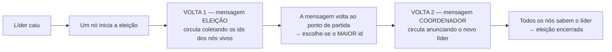
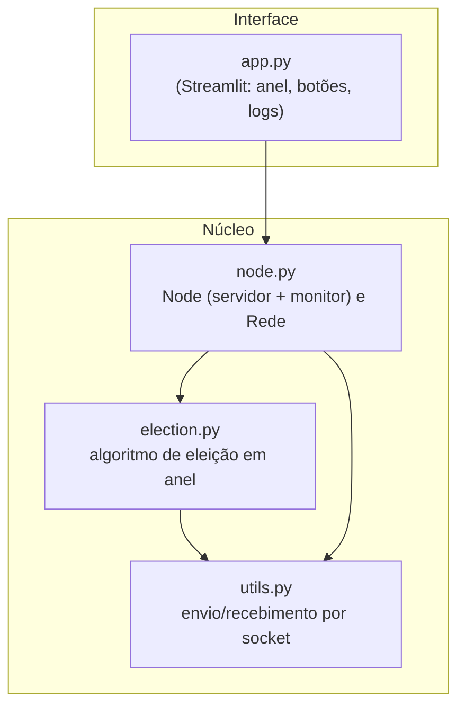
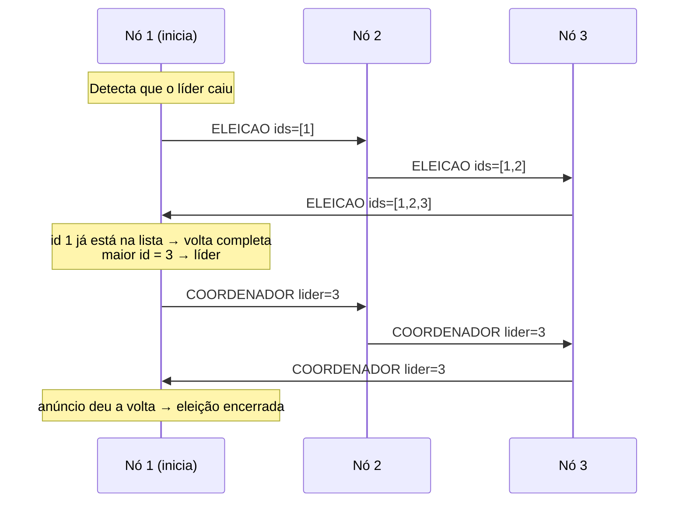
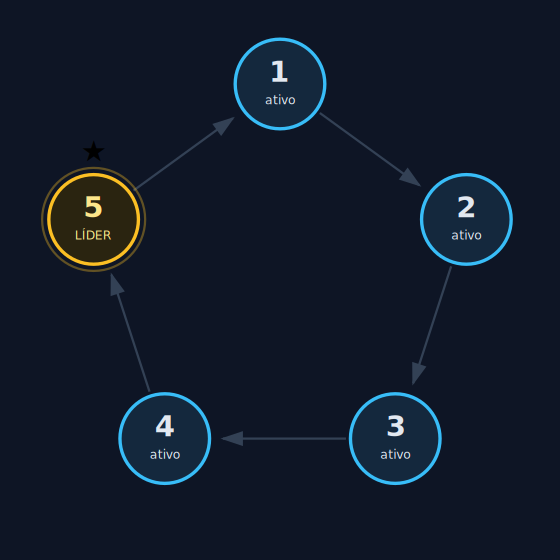
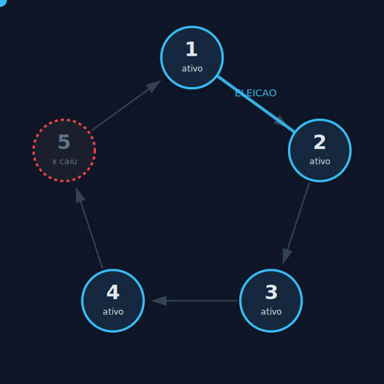
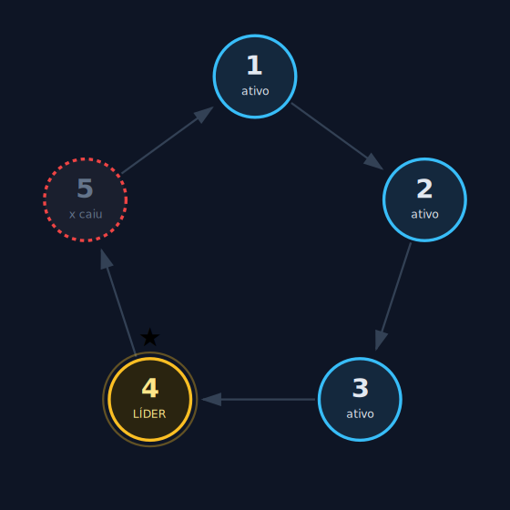

# Relatório — Algoritmo de Eleição em Anel

**Grupo 8** · Sistemas Distribuídos · UFSC Araranguá

---

## Sumário

1. [Proposta do trabalho](#1-proposta-do-trabalho)
2. [O que é o algoritmo de eleição em anel](#2-o-que-é-o-algoritmo-de-eleição-em-anel)
3. [Arquitetura da solução](#3-arquitetura-da-solução)
4. [Requisitos funcionais do cliente e do servidor](#4-requisitos-funcionais-do-cliente-e-do-servidor)
5. [Comunicação entre processos (com diagrama de sequência)](#5-comunicação-entre-processos)
6. [Como o serviço é executado no servidor (cada nó)](#6-como-o-serviço-é-executado-no-servidor)
7. [Blocos de código essenciais](#7-blocos-de-código-essenciais)
8. [Detecção de falha e recuperação](#8-detecção-de-falha-e-recuperação)
9. [Análise: por que anel, vantagens, desvantagens e complexidade](#9-análise)
10. [Instalação e execução](#10-instalação-e-execução)
11. [Prints da interface](#11-prints-da-interface)
12. [Exemplos de execução e testes](#12-exemplos-de-execução-e-testes)

---

## 1. Proposta do trabalho

O objetivo é implementar e **demonstrar visualmente** o **algoritmo de eleição
de líder em anel**, um dos algoritmos clássicos de coordenação em sistemas
distribuídos. Em sistemas sem um "chefe" central, frequentemente é preciso
eleger um processo coordenador (por exemplo, para coordenar exclusão mútua ou
replicação). Quando esse coordenador falha, o sistema precisa **eleger um novo**
de forma automática e sem conflitos.

Nossa implementação cumpre todos os requisitos do enunciado:

- múltiplos **processos/nós** identificados por um **id** único;
- **comunicação** entre nós via **sockets TCP** (cada nó é cliente e servidor);
- **eleição** do líder, **detecção de falha** do líder e **nova eleição**;
- **atualização** global de quem é o coordenador;
- **logs** claros e **visualização** do estado dos nós em tempo real (Streamlit).

---

## 2. O que é o algoritmo de eleição em anel

Os processos são organizados em um **anel lógico**: cada nó conhece o "próximo"
da roda (seu **sucessor**). A eleição acontece em **duas voltas**.



**Volta 1 — ELEIÇÃO (coleta de candidatos):**
1. Um nó percebe que o líder caiu e **inicia** a eleição.
2. Ele cria uma mensagem de ELEIÇÃO com uma lista contendo o **seu próprio id**.
3. Envia a mensagem ao próximo nó **vivo** do anel.
4. Cada nó que recebe **adiciona o seu id** à lista e repassa adiante.
5. Quando a mensagem chega a um nó cujo id **já está na lista**, ela deu a
   **volta completa**. Esse nó olha a lista e escolhe o **maior id** como líder.

**Volta 2 — COORDENADOR (anúncio):**
6. O nó que fechou a volta cria a mensagem COORDENADOR (“o líder é o nó X”).
7. Cada nó que recebe **atualiza** quem é o líder e repassa.
8. Quando o anúncio dá a volta completa, **todos** sabem o coordenador.

> **Por que vence o maior id?** É apenas uma regra **determinística combinada**.
> Qualquer critério serve, desde que **todos** usem o mesmo — assim todos chegam
> ao mesmo vencedor sem precisar de um árbitro central. Escolhemos "maior id".

---

## 3. Arquitetura da solução

O código foi separado em camadas, para que cada arquivo tenha **uma única
responsabilidade** e seja fácil de explicar:



- **`utils.py`** concentra todo o trabalho "com bytes na rede": serializar a
  mensagem em JSON, enviá-la por um socket TCP e lê-la do outro lado.
- **`election.py`** contém **só o algoritmo** — lê como uma receita, sem ruído
  de rede ou de interface.
- **`node.py`** define o **nó** (que roda um servidor de socket e um monitor de
  falhas em threads) e a **Rede** (que cria e gerencia vários nós).
- **`app.py`** é a interface visual (Streamlit) que cria o anel, dispara as
  ações (criar, derrubar, reviver) e anima as mensagens em tempo real.

O **anel** é representado por uma lista ordenada de endereços que vive **apenas
na camada de membership** (`Rede`), não em cada nó. A posição na lista define
quem é o sucessor de quem; cada nó pergunta `proximo_vivo(meu_id)` e guarda só o
seu sucessor (modelo puro):

```python
# node.py — classe Rede: o "mapa do anel" (membership), que os nós NÃO copiam.
self.anel = [
    {"id": id, "host": host, "porta": porta_base + i}
    for i, id in enumerate(ids)
]
```

---

## 4. Requisitos funcionais do cliente e do servidor

Cada **nó é, ao mesmo tempo, cliente e servidor**:

- **como servidor**, mantém um socket TCP **escutando** em uma porta e trata
  cada mensagem que chega;
- **como cliente**, **abre conexões** para enviar mensagens ao seu sucessor.

### Identificação dos processos

Cada nó recebe um **id inteiro único** e uma **porta TCP** própria. Os ids vão
de `1` a `N` e cada nó escuta em uma porta a partir de uma base. O id é o
critério de eleição (maior vence).

### Tipos de requisição (mensagens) enviadas e recebidas

Todas as mensagens são **dicionários em JSON**, identificados por um campo
`tipo`. Os tipos são definidos em `utils.py`:

| Tipo | Direção | Conteúdo | Para que serve |
|---|---|---|---|
| `ELEICAO` | nó → sucessor | `ids` (lista), `iniciador` | coleta os ids dos nós vivos (Volta 1) |
| `COORDENADOR` | nó → sucessor | `lider`, `iniciador`, `visitados` | anuncia o líder eleito (Volta 2) |
| `PING` | monitor → sucessor | — | "você está vivo?" (detecção de falha) |
| `PONG` | sucessor → monitor | `id` | resposta: "estou vivo!" |

---

## 5. Comunicação entre processos

A comunicação usa **TCP**, com um protocolo simples (de propósito): **uma
conexão = uma mensagem**. O remetente abre o socket, conecta, envia o JSON
terminado por `\n` e fecha; o destinatário aceita a conexão, lê até o `\n` e
processa. Se a conexão **falha** (o nó está morto), o remetente simplesmente
**pula para o próximo** nó vivo do anel.

### Diagrama de sequência — uma eleição completa (3 nós: 1, 2, 3)



---

## 6. Como o serviço é executado no servidor

Quando um nó é ligado (`Node.iniciar()`), ele **cria e abre o socket de escuta
ali mesmo** — faz o `bind`/`listen` de forma síncrona, **antes** de subir as
threads. Isso é importante: se a porta estiver ocupada, a falha é percebida na
hora (vira um log de erro) em vez de morrer em silêncio dentro de uma thread de
fundo — o que deixaria o nó "ativo" porém surdo e quebraria o anel sem aviso.
Com o socket já pronto, o nó sobe **duas threads de fundo**:

1. **Thread do servidor** (`_loop_servidor`): apenas fica em `accept()` e, para
   cada conexão recebida, trata a mensagem conforme o `tipo`.
2. **Thread do monitor** (`_loop_monitor`): de tempos em tempos envia um `PING`
   ao **seu sucessor** (o único nó que conhece); se não vier `PONG`, conserta o
   anel e, **se o nó que caiu era o líder**, inicia uma nova eleição.

O "despacho" das mensagens recebidas é o coração do lado servidor:

```python
# node.py — decide o que fazer com base no tipo da mensagem recebida
if tipo == MSG_PING:
    conexao.sendall(codificar({"tipo": MSG_PONG, "id": self.id}))
elif tipo == MSG_STATUS:
    conexao.sendall(codificar(self.snapshot()))
elif tipo == MSG_INICIAR_ELEICAO:
    election.iniciar_eleicao(self)
elif tipo == MSG_ELECTION:
    election.processar_eleicao(self, mensagem)   # Volta 1
elif tipo == MSG_COORDINATOR:
    election.processar_coordenador(self, mensagem)  # Volta 2
```

---

## 7. Blocos de código essenciais

### 7.1 Envio de mensagem (lado cliente)

```python
# utils.py
def enviar_mensagem(host, porta, mensagem, timeout=1.0, esperar_resposta=False):
    try:
        with socket.socket(socket.AF_INET, socket.SOCK_STREAM) as s:
            s.settimeout(timeout)
            s.connect((host, porta))          # falha aqui se o nó estiver morto
            s.sendall(codificar(mensagem))    # serializa (JSON + '\n') e ENVIA
            if esperar_resposta:
                resposta = _ler_linha(s)
                return json.loads(resposta) if resposta else None
            return True
    except (ConnectionRefusedError, socket.timeout, OSError, ValueError):
        return None                           # "não consegui falar com o nó"
```

### 7.2 Recebimento de mensagem (lado servidor)

```python
# utils.py
def receber_mensagem(conexao):
    try:
        linha = _ler_linha(conexao)           # lê bytes até encontrar '\n'
        return json.loads(linha) if linha else None
    except (OSError, ValueError):
        return None                           # mensagem incompleta/inválida
```

### 7.3 Definição dos números (ids) dos processos

```python
# node.py — MODELO PURO: cada nó conhece APENAS o seu sucessor
class Node:
    def __init__(self, id, host, porta, rede, ...):
        self.id = id                # identificador único; MAIOR id vence
        self.porta = porta          # porta TCP onde este nó escuta
        self.sucessor = None        # {id, host, porta} do próximo nó vivo (único vizinho conhecido)
        self.rede = rede            # serviço de topologia: responde "quem é o meu sucessor?"
```

> O nó **não** guarda a lista de todos os nós. Quem conhece a ordem do anel e
> quem está vivo é a classe `Rede` (camada de *membership*), separada do
> algoritmo. O nó pergunta a ela `proximo_vivo(meu_id)` e guarda só a resposta.

### 7.4 Núcleo do algoritmo — processar uma mensagem de ELEIÇÃO

```python
# election.py
def processar_eleicao(no, mensagem):
    ids = mensagem["ids"]
    if no.id in ids:                          # a mensagem deu a volta completa
        novo_lider = no.rede.maior_vivo(ids)  # vence o MAIOR id ainda VIVO
        anuncio = {"tipo": MSG_COORDINATOR, "lider": novo_lider,
                   "iniciador": no.id, "visitados": [no.id]}
        _aplicar_lider(no, novo_lider)
        _enviar_para_sucessor_vivo(no, anuncio)   # começa a Volta 2
    else:
        ids.append(no.id)                     # entro na disputa
        _enviar_para_sucessor_vivo(no, mensagem)  # repasso adiante
```

### 7.5 Repasse para o sucessor (um salto de cada vez)

```python
# election.py — o nó pergunta ao serviço de topologia quem é o próximo nó vivo
def _enviar_para_sucessor_vivo(no, mensagem):
    ignorar = set()
    while True:
        sucessor, _ = no.rede.proximo_vivo(no.id, ignorar=ignorar)
        if sucessor is None:                  # ninguém mais vivo → sou o líder
            _aplicar_lider(no, no.id)
            return False
        no.sucessor = sucessor                # passa a conhecer este sucessor
        entregue = enviar_mensagem(sucessor["host"], sucessor["porta"], mensagem)
        if entregue is not None:
            return True                       # entregue ao sucessor vivo
        ignorar.add(sucessor["id"])           # caiu na hora → pede o próximo vivo
```

O nó nunca varre o anel: ele só envia para o **sucessor** que o serviço de
topologia (`Rede.proximo_vivo`) indica. Quem "pula" os nós mortos é a camada de
*membership* — o algoritmo continua sendo um salto por vez.

---

## 8. Detecção de falha e recuperação

A detecção de falha respeita o **modelo puro**: como cada nó só conhece o seu
sucessor, é só ELE que o nó consegue vigiar (não dá para "pingar o líder"
diretamente — o nó nem sabe o endereço dele). Cada nó manda periodicamente um
`PING` ao **seu sucessor**. Como cada mensagem abre uma conexão TCP nova, um nó
**morto recusa a conexão** — e é assim que a falha é percebida.

Em um anel, todo nó tem exatamente um antecessor; logo, a queda de qualquer nó é
detectada por **exatamente um** vizinho: o seu antecessor. Em particular, a
queda do **líder** é detectada pelo antecessor do líder, que então dispara a
nova eleição (isso, de quebra, já evita a "tempestade de eleições", pois só um
nó reage).

```python
# node.py — dentro do _loop_monitor
resposta = enviar_mensagem(sucessor["host"], sucessor["porta"],
                           {"tipo": MSG_PING}, esperar_resposta=True)
if resposta is None:                          # sucessor não respondeu → caiu
    # 1) sempre CONSERTA o anel: novo sucessor = próximo nó vivo (pula o morto)
    novo, pulados = self.rede.proximo_vivo(self.id, ignorar={morto})
    self.sucessor = novo
    # 2) só RE-ELEGE se o nó que caiu era o líder conhecido
    if self.lider_conhecido in ({morto} | set(pulados)):
        self.lider_conhecido = None           # evita disparos repetidos
        election.iniciar_eleicao(self)         # inicia nova eleição
```

**Decisões de projeto:**

- **Queda de um nó comum** apenas reconfigura o anel (conserta o ponteiro do
  sucessor), **sem** nova eleição;
- a checagem `lider_conhecido in {morto} ∪ pulados` também cobre o caso de o
  **líder e o seu antecessor caírem quase juntos**: quem detecta é o nó anterior
  a ambos, e o líder aparece na lista de `pulados` saltados no conserto;
- a Volta 2 (`COORDENADOR`) tem uma lista `visitados` que **impede laços
  infinitos** caso o iniciador caia no meio do anúncio;
- um lock garante que, mesmo com uma eleição manual concorrente, **só uma**
  eleição comece.

**Recuperação:** quando o nó que caiu volta (`reviver()`), ele reentra no anel.
Se o seu id for o maior, basta uma nova eleição (manual ou disparada por outra
falha) para que ele reassuma a liderança.

---

## 9. Análise

### Por que usar um anel?

- A topologia é **simples e previsível**: cada nó só precisa conhecer o
  próximo, e a mensagem segue sempre o mesmo caminho.
- **Não há ponto central** de decisão: a eleição é totalmente distribuída.
- É **fácil de visualizar e ensinar** — dá para "ver" a mensagem dando a volta.

### Vantagens

- Implementação direta e com pouca informação de estado por nó.
- Tolerante a falhas: o repasse **pula nós mortos** e continua circulando.
- Resultado **determinístico** (todos concordam no mesmo líder).

### Desvantagens

- A mensagem percorre o anel inteiro: **latência cresce** com o número de nós.
- Sensível a **múltiplas falhas simultâneas** no caminho (mitigado aqui pelo
  "pular para o próximo vivo").
- Em anéis muito grandes, há mais saltos do que algoritmos baseados em
  difusão direta (como o de Bully).

### Complexidade de mensagens

Para `n` nós, em uma eleição:

- **Volta 1 (ELEIÇÃO):** ~`n` mensagens para dar a volta.
- **Volta 2 (COORDENADOR):** ~`n` mensagens para anunciar.
- **Total:** da ordem de **`2n` mensagens** → complexidade **O(n)** por eleição.

(O algoritmo de Bully, para comparação, pode chegar a O(n²) mensagens no pior
caso, mas costuma anunciar o líder mais rapidamente em redes pequenas.)

---

## 10. Instalação e execução

### Pré-requisitos

- **Python 3.10+**
- **Streamlit** (única dependência externa; o resto usa a biblioteca padrão).

### Instalação

```bash
pip install -r requirements.txt
```

### Execução — interface visual

```bash
streamlit run app.py
```

Na barra lateral, ajuste a **quantidade de nós** e o **atraso por salto** (quanto
maior, mais devagar a mensagem viaja — ótimo para explicar). Clique em
**Criar anel / Reiniciar**.

---

## 11. Prints da interface

**Anel estável, com o líder eleito (nó de maior id):**



**Líder derrubado: o nó fica vermelho (✖) e uma mensagem de ELEIÇÃO circula:**



**Após a nova eleição: o maior id entre os vivos assume a liderança:**



> Na interface ao vivo, o líder aparece em dourado, os nós ativos em azul,
> os caídos em vermelho tracejado, e uma **seta dourada** destaca a aresta por
> onde a mensagem está viajando (tracejada quando o salto pula um nó morto).
> A **linha do tempo** ao lado mostra cada evento.

---

## 12. Exemplos de execução e testes

Validamos o comportamento com três cenários (todos passaram):

**Cenário A — eleição inicial (4 nós: 1, 2, 3, 4):**
o nó 1 inicia; a lista coletada é `[1, 2, 3, 4]`; vence o **nó 4**.

**Cenário B — falha do líder:**
derrubamos o nó 4; o **antecessor do líder** (nó 3) detecta a queda (PING sem
PONG ao seu sucessor); nova eleição automática elege o **nó 3** (maior id entre
os vivos `[1, 2, 3]`).

**Cenário C — recuperação:**
o nó 4 volta; uma nova eleição o reconduz à liderança (**nó 4**).

Trecho real do log da eleição inicial:

```
🗳️  Nó 1 INICIOU uma eleição.
➕ Nó 2 entrou na disputa. Lista de candidatos agora: [1, 2].
➕ Nó 3 entrou na disputa. Lista de candidatos agora: [1, 2, 3].
➕ Nó 4 entrou na disputa. Lista de candidatos agora: [1, 2, 3, 4].
🔁 Eleição deu a volta completa. Candidatos vivos: [1, 2, 3, 4]. Maior id = 4 → novo líder!
👑 Nó 1 reconhece o nó 4 como líder.
👑 Nó 2 reconhece o nó 4 como líder.
👑 Nó 3 reconhece o nó 4 como líder.
👑 Nó 4 reconhece o nó 4 como líder (sou eu!).
✅ Anúncio do coordenador deu a volta completa. Líder confirmado: nó 4. Eleição encerrada.
```

Trecho real após derrubar o líder (recuperação automática):

```
⚠️  Nó 2 detectou que o líder (nó 4) caiu!
🗳️  Nó 2 INICIOU uma eleição.
➡️  Sucessor (nó 4) não respondeu; pulando para o próximo.
🔁 Eleição deu a volta completa. Candidatos vivos: [2, 3, 1]. Maior id = 3 → novo líder!
👑 Nó 3 reconhece o nó 3 como líder (sou eu!).
✅ Anúncio do coordenador deu a volta completa. Líder confirmado: nó 3.
```
